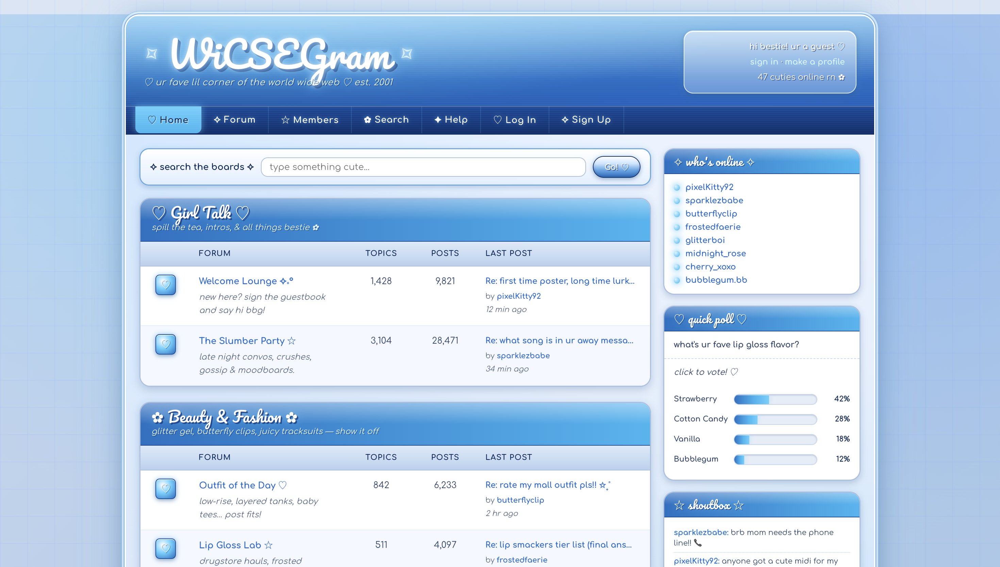
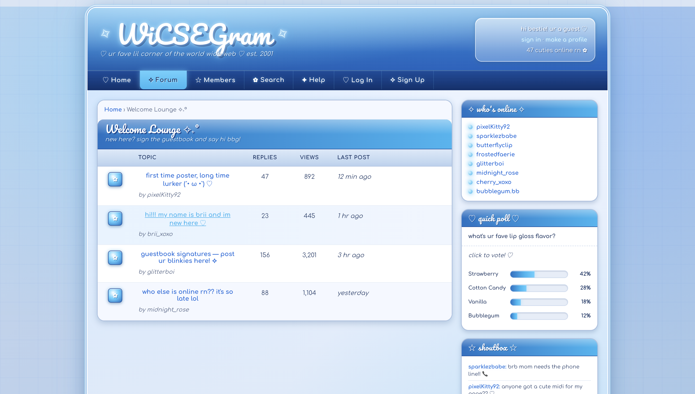
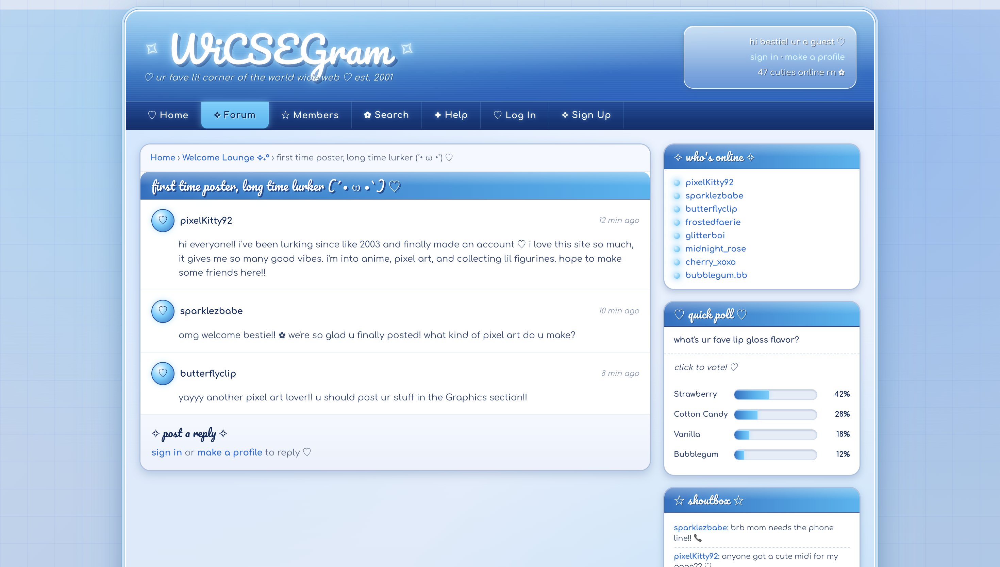
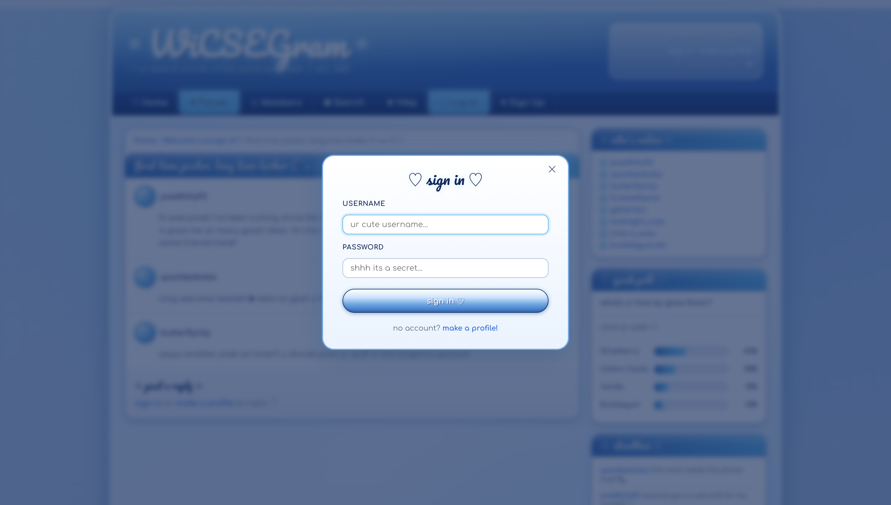
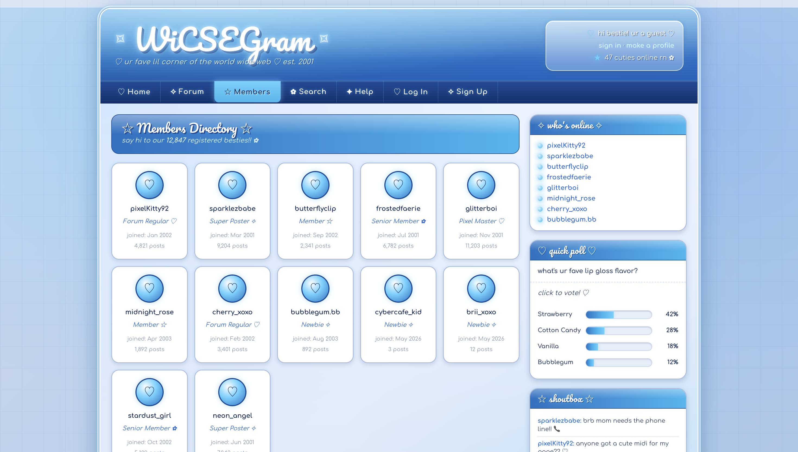

WiCSEGram
---

WiCSEGram is a Y2K-themed forum app built for WiCSE (Women in Computer Science & Engineering) member, styled like an early 2000s internet message board





Features

Navigation
All seven nav tabs are fully functional and navigate between distinct views without a page reload:

Home - Forum category listing with all boards 
Forum - Same as Home — the main board index 
Members - Member directory grid with join date & post count
Search - Live search across all thread titles with results table 
Help - Accordion-style FAQ 
Log In -  Modal with username + password form 
Sign Up - Modal with username, email + password form

Forum Browsing



Clicking a forum board drills into a topic list. Clicking a topic opens the thread view with all posts. Breadcrumb links let you navigate back at any level.

Thread View & Replies



Guests can read threads but need an account to reply. Once signed in, a reply box appears at the bottom of every thread and new posts are added live.

Login / Register



This is local session only as it does not have any backend. Entering any username signs you in. The welcome box in the header updates to greet you by name and showa a log out link.

Members Directory



Search

Search filters across all thread titles in real time when you hit Enter or click Go. Results link directly to the matching thread or its parent forum.

Interactive Sidebar

- **Who's Online** — links to the Members directory
- **Quick Poll** — click any option to cast a vote; bars animate to the new percentages and a thank-you message appears
- **Shoutbox** — type a message and press Enter or hit ♡ to post; logged-in users post under their username, guests post as "Guest"

---

## ✦ Tech Stack

| | |
|---|---|
| Framework | [React 19](https://react.dev) |
| Build tool | [Vite 8](https://vite.dev) |
| Styling | Plain CSS (no UI library) |
| Fonts | Pacifico, Comfortaa, VT323 via Google Fonts |
| State | `useState` only — no external state library |
| Routing | Client-side via state (`page`, `currentForum`, `currentThread`) |
| Data | All mock data in-memory — no backend or API |

---

## ☆ Getting Started

```bash
# install dependencies
npm install

# start the dev server
npm run dev
```

Then open [http://localhost:5173](http://localhost:5173) (or whichever port Vite picks if 5173 is busy).

```bash
# production build
npm run build

# preview the production build locally
npm run preview
```